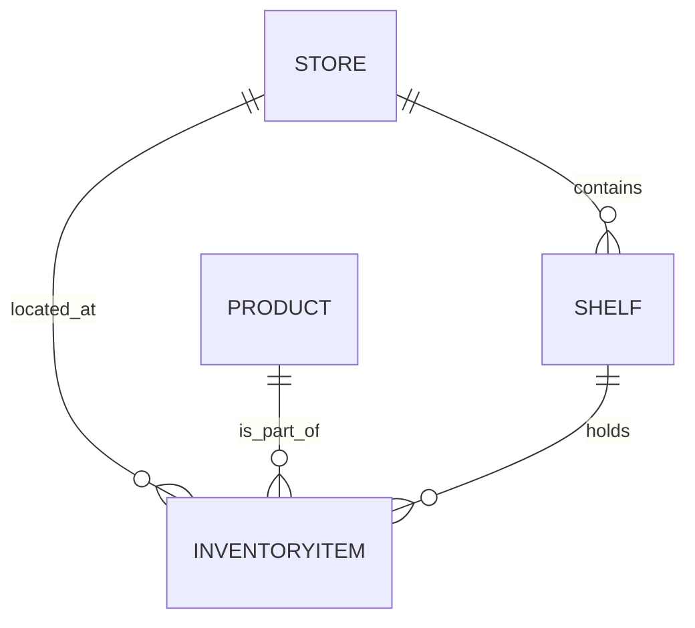

# Data Model Extraction: FIWARE CRUD Operations

The following data model was extracted from the [FIWARE CRUD Operations Tutorial](https://fiware-tutorials.readthedocs.io/en/latest/crud-operations.html).

## Entities and Attributes

### 1. Store
Represents a physical retail building.

| Attribute | Type | Description / Example |
| :--- | :--- | :--- |
| `id` | `urn:ngsi-ld:Store:<id>` | Unique identifier |
| `type` | `Store` | Entity type |
| `name` | `Text` | name of the store (e.g., "Checkpoint Markt") |
| `address` | `Text` | Full address (e.g., "Friedrichstraße 44, 10969 Kreuzberg, Berlin") |
| `image` | `Text (URL)` | image URL representing the store |
| `location` | `geo:json` | physical location (e.g., `52.5075 N, 13.3903 E`) |

### 2. Shelf
Represents a physical object to hold items for sale.

| Attribute | Type | Description / Example |
| :--- | :--- | :--- |
| `id` | `urn:ngsi-ld:Shelf:<id>` | Unique identifier |
| `type` | `Shelf` | Entity type |
| `name` | `Text` | name of the shelf (e.g., "Wall Unit") |
| `location` | `geo:json` | physical location of the shelf |
| `maxCapacity` | `Integer` | maximum number of items the shelf can hold |
| `refStore` | `Relationship` | Association to the `Store` where the shelf is located |

### 3. Product
Represents a conceptual object that is sold.

| Attribute | Type | Description / Example |
| :--- | :--- | :--- |
| `id` | `urn:ngsi-ld:Product:<id>` | Unique identifier |
| `type` | `Product` | Entity type |
| `name` | `Text` | name of the product (e.g., "Lemonade") |
| `price` | `Integer` | price in cents (e.g., 99) |
| `size` | `Text` | Size of the product (e.g., "S", "M", "L") |
| `image` | `Text (URL)` | image URL representing the product |

### 4. InventoryItem
A conceptual entity that associates products, stores, and shelves.

| Attribute | Type | Description / Example |
| :--- | :--- | :--- |
| `id` | `urn:ngsi-ld:InventoryItem:<id>` | Unique identifier |
| `type` | `InventoryItem` | Entity type |
| `refProduct` | `Relationship` | Reference to the `Product` entity |
| `refStore` | `Relationship` | Reference to the `Store` entity |
| `refShelf` | `Relationship` | Reference to the `Shelf` entity |
| `stockCount` | `Integer` | Total items available in the warehouse |
| `shelfCount` | `Integer` | Items currently available on the shelf |

## Entity Relationships

